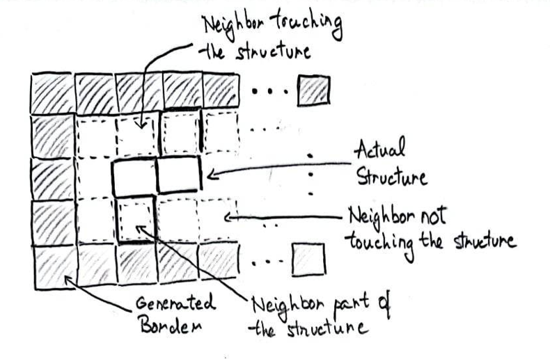
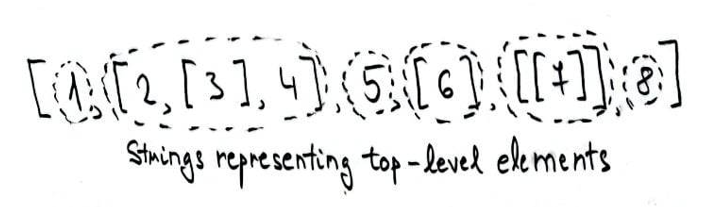

# My top 3 Advent of Code puzzles from 2022

> Read the updated version of this document on my [medium story](https://medium.com/@ozoniuss/top-3-advent-of-code-2022-puzzles-9769d780f8da). 

This year, I decided to attempt solving the contest's puzzles on a daily basis. I already left an overview of the contest [here](https://github.com/Ozoniuss/Algorithms/tree/master/advent-of-code-2022), now I wanted to talk about 3 of the problems that I liked the most, and another 3 I considered when making this list that in the end didn't make the cut. During the contest, I often found myself saying something like "oh, this problem was cool", and figured that since I liked many of the problems, this could be the perfect moment to make my first top 3 post.

Before starting the review, huge thanks to [Eric Wastl](http://was.tl/), the creator of the contest. The diffculty progression was not linear and really well thought out, as the problems were overall increasing in difficulty, but after some hard problems you would also get an easier one to relax a little. I believe there was a tremendous amount of effor that was put into designing the problem statements, and particularly, generating the puzzle inputs. There are many considerations for all problems to produce a nice input, but just to give an example, look at [day 24](https://adventofcode.com/2022/day/24). Not only there must be a generated input where there exists a path from start to finish that avoids all blizzards, there also must be a valid place to move to if a blizzard is about to hit you, AND the path must be of reasonable length to not run the algorithm for hours. Did I mention that part 2 required 3 trips between the start and finish, thus with different blizzard locations?? If that doesn't sound impressive, just look at the size of the actual input, not example input:

```
#.########################################################################################################################
#<<<^<^^>v<<^<^><><v<^<<.v^><<<v>><^v<vv>v<vv>^>>^^^^.>>^vv<^<<>^.vv.<>>v>v^>^<><.vv^v.^<^v>^vv<^vv<<>v<<>><<<v^^>v><<<^>#
#>^^v><.<>>v.v.^>v^..>^<vv>v^><v^<<>v>>.^v^vv^^>.^><^>>^>vv>>v^>vvvv^v^vv<<^<^>^>^v<v^>><><v^^^<v.^v<>^.>v><vv.^<^^^^<>>>#
#<<.><>v<>.v^<^^v<^^>.^.>>v.^^^v>^^^.<><.^.<>>^<>.v><^^^>^>^^^^><vv^.v^<<^v>v^^^<<<^<..^vv><.^v<vv^>>vv>v.><v^>>^<v^>>vv>#
#.><^v.>^v>>vv><^>.>>>>>^.>>.>^v>v^>v^^>v^^..>^.^<^.v<>v<<<^^^.vvv>>.<>^vvv>>.^<^v^>^<^<vv>^>^.<>^<<>v.<<<.^<>^>.<v.vvv^>#
#>><v<>.v><<^^vvv<<<^>^v^v><^>^<>>v.<.<>^<>vv>vv>^.v><<<^<v^vvv.<<<><^<^<^.^^vv>^v^^v<>>vv^<^.^v^v<v^>^.>.v>v^^<v<^<>^>v>#
#>>><v<.>>v^<.^vvvv<v<^<<v>>v>vv.^><v^.>>vv><<.<^.^v>^^><>^<^v<vvvvv<<<<^^>..>>>v^^>.vv<>.^^^.<v>v^>>^>^^>v^v^^<.>>^^<.<>#
#<<v>>v<>^><^v<>^>vvv..v.^.<^.v.vv^.<.v<>v>^<^v^<^>><.<>v^v>^<<^<v^^<v^<v^.<v><<<>^^<><>.v><^^^<<^<v>><vv<^<^.^<<^.^<<v>>#
#>>>^^>v^>^>>v><<>^<v><>>^>.<v<<>v<>^<>^v.<<^.^^^^>^.v>v><v^>vv^^^.>v^<v^^v<<^.vv^>vvv>^>>v<.^^vv<<v.v..^v.^vvv.<.>^<^v>>#
#><^vv^>>v.<^<v^^><v^>^><<<v^>v><v^^>><vv^><.>>^vv>><vv<^v^v^>^>>.vvvvvv<>>>.>^<vv^<vv<<<^^v^>.v><^.<<^<>^^>.^v><^^vv.^>>#
#>..<<v<<>>.<^v<<.>v^<..^<^^v^>.><.<v>>v><<>^>>v<vvv>>v<v>.vvvv<.<<<^<^v>^<v^>>v.^v^<^v..^..<^<><>^<<>^>^<<^^.>^^<v<>v<><#
#<v^v>v<^^<v>>vv^v<..^>v>>>.>^^<>>>^..>>>^<<^<^<>^<v>>^>>><^v^v^<.^<<<^v^.^^^<v>>><^^<>>><..vv.^.^<<v^v.>>^v^^><>><.v^>v>#
#.<^^<v>v.<v<^.^v^<.v^vvv^vv^<..v<.>>>v<<>>vv>>^.>^.v>vv>.v^<<v^>>v.<^^<^<<>^^.^^>^>>^<^<<^^vv^^.<.><^.>^^<>v<.^v<>v><v<.#
#>^.v^^><^<.>^v>v><>>>..>.v>vvv<<vv^.>v>.>v.<^vv.^>^vvv>.>v^v>>.>^^<<>>.^.>>>^>v<>v>v^^<>^<^.^><.vv^^<<.^v>>.>>>.^>^^^^^<#
#..^>vv><^^.>>^^.<<<v..<<>^.<.<^^.v<<<^<<>><>v>v<^^^.<><^<<>v^^<^v^>^v>v<<^<<v<><<>.><..<^vv^<.><>^^><<.>>^.^v><>v^<^v>^>#
#><<>v>.>^<<v>>>>>^>v..<vv<^<v>>^<<^v<v<<<<.v^>v.v<^>>>v.^><^><>.<>.^v><><<v>^^^^.<<.>^>><>.<<.<^<.^>..^>^.^>^v^v.<.^v>><#
#><><^v.<<<<>>v<<<<^v<<^^<><<.>^^.^.^.<>vv<<<v>^<><^^<^>^>^^.v<^>>vv^v.>^.<<><vv>>.>.<><^<.<<>.v>.^>>>^<<>.<v>^^v^v^<>.<<#
#<^>^v^>v^v.<^^>.^>^<<>.<.<<vvv>v>v^v^vvv>v^v^v<^^^<^>>v.^v.^>v><.^^^<>^>^^vv.v>>>^v<<>>^<^.v^>>>><v>v><^<.^v^v^^.<<>><^<#
#>^>v.><v<^<><>><v<^^<^><<<<^v>^<v^>v<<>^>>.><v<v<^^>^<><><^<.<.<><v^^.^>>v^v^.>><vvvv^v^vv><<^<<^>.v>>>vv>v^v^^<v^^>^>><#
#<<v^^>vv^^v.<<v<v<^><^v.>.<^v^>^^>^<^^v>>v<^^vv<>^v^.^v<>.<^^>^^v><>^^v.><.v^^>.<<.v^<v<^<>^<^><v^>.>^v>v<v<.>v<.<v.>.<<#
#>^<<v^vv..vv^v><>>>^>v.>v^..^>^vv>^^>v^v<>.><v<<<<^><>v^.v^>.>^vv>vv>.>^<<.v<^^v^<<>^^^>^.<.v>^><.<^<^>>><.<<^^^>^<^<v<>#
#<^><v<v><<<>v>>vv.>^<v>><>v>^.v^<v><<^<>>^<^^.<v<<vv>^v.v.<vv<^<<^>v>v.<<<v^><^^>.>>v>.<^vv.^v>^^^<><<^<>>><v^v>>>v<^>v>#
#>>>^.v><<<>^v<.<.^><v>><>.<.<>v^v>>>^<^^vvv.vv<v<^^^>><^v>>>v>v<>v<v<vv^.^>v<>^>>>^<<v<vv^>><.v<^v<v^<.<>v>^>^><.>v<>.><#
#<^<v>v.vv>vv^v<.>>.v.^..>^v<.v><>^<.^^<v><^.v^<v^vv^^v^<>>^<^><v.vvv^>.^v>><<>><<<>.<v^<^.<vv^.v<><v^v^>^v^>v<<v^>vv>^v>#
#<><.v.^v>>><^.<.^<<v>^^><<^>>.^^.v>vv^^.v>^<<^^<<<^>>^>^>v..^v><>v<vv<<v^v<>>><v>^v<><.>v>v>v^^.^>>vv^v.vv<>v^<><^^><vv<#
#<<v<v>^><^v^<^<v>><.v<.>^vv^>^<v^v>v<.vvv<v<^^>^^^^v^<<v^>v<v^vv>.^vv>v^.>>.^<.>>v<..^v.>^<<v<vvv^<..^<<>^^>v<<><^^><>>>#
########################################################################################################################.#
```

Now, let's move on to the actual review. I want to prefix this by mentioning that I won't be including any algorithm implementations here. You can find my full implementations for all problems on my [GitHub repository.](https://github.com/Ozoniuss/Algorithms/tree/master/advent-of-code-2022)

### 3. Day 18: Boiling Boulders

The [day 18 puzzle](https://adventofcode.com/2022/day/18) was one of the later-stage problems, where concepts like recursion and backtracking were already introduced. What I liked most about this problem was difficulty hidden in simplicity: the statement describes a simple scenario and a simple goal, that is however quite difficult to achieve. In short, the problem provided you the integer coordinates of a bunch of unit (1x1x1) cubes, and part 1 was solved by computing the number of faces that touch (or rather, _not_ touch). Part 2 made you imagine that the structure is submerged in water, and you had to compute the number of faces that get touched by water (I found that thinking about it this way makes it more clear what the goal is).

I also liked the fact it was easy to think of this problem as in a real-life scenario. This was often not the case for the other problems of the contest. I do believe that this might be a well-known problem given the statement, but I personally didn't know about it, since I wasn't really into competitive programming.

Part 1 was trivial and I've done it very fast, but that changed in part 2. It was interesting to see the difference in difficulty by just changing the final goal and keeping the original setup. In the second part, you can't really take a look at the neighbours and determine whether water reaches you based on that; for instance, there could be even structures within structures that the water will never be able to reach!

I soon realized that my only workable approach I thought about to solve the problem was to simulate water infiltrating the structure. But I needed a starting point to commence the simulation from somewhere, so I computed the exterior bounds (consisting of unit cubes) of the unique cube with smallest volume in which the structure was fully contained. Then, starting from the unit cubes forming the bound, I generated their neighbours that were inside the bound, then the neighbours of the neighbours generated previously and so on. This is basically multi-source BFS in space, where the initial sources are the unit cubes on the bound.

This approach doesn't reveal though how you count the wet faces, which is the actual task. For that, when generating the neighbours, they can either be:

- not touching the structure;
- touching the structure;
- actually part of the structure.



The first and last case aren't relevant, but the second case is. The second case actually stands for water touching faces of the cube structure. The trick here is that a common face between two cubes is unique for those two cubes, so assuming you keep track of the already-generated water, you will never be counting the same face twice.

On a final note, there are some nice visual representations of this problem on the [subreddit.](https://www.reddit.com/r/adventofcode/)

### 2. Day 13: Distress Signal

The [day 13 puzzle](https://adventofcode.com/2022/day/13) is the first one that really introduced recursivity to these problems. You were given lists whose elements were either integers, lists of integers, or empty lists. So an input could look like this:

```
[[1],[[2],3,4]]
```

The problem described a method to compare two different lists, which was not that difficult to implement once you had your recursive model, because walking through the list and performing the comparison was defined thoroughly in the statement and you just had to put that into code. But actually defining the model and parsing the input was a whole other challenge. I settled with this as my model:

```go
// Syntactic sugar
type element int

// leveledArray can either be an element (a level 0 array) or an array of
// leveledArrays.
type leveledArray struct {
	element int
	array   []leveledArray
}
```

The idea behind is that I considered an element to still be a `leveledArray`. Think of it as an array of level 0, whereas the other arrays have a level equal to the maximum "depth" of the array. I won't define that thoroughly here, but just to give some examples, `[1,2,3]` would have level 1, `[[1], 2, [3]]` would have level 2, `[[[1], 2], [3], 4]` would have level 3 etc.  


I'd also like to explain what I consider to be the top-level items of a leveled-array with non-zero level: it's simply the leveled-arrays that are the elements of the parent away. To explain that into code, it's the `leveledArray` object you would access by indexing the `array` field, like `leveledArray.array[0]`.

One more comment regarding implementation, one `leveledArray` can either have the `array` field `nil`, in which case it's an element, or some array (including an empty array), in which case it's an array of leveled arrays. Go doesn't have classes nor inheritance, so this is just the simplest approach I went with.

With that in mind, we defined a `leveledArray` model recursively as either an element, or an array of `leveledArray` objects. The benefit of this recursive object is that it does allow for a straightforward implementation of the comparison function. 

The actual challenge was converting a string to this type of object. The other way around is quite simple; if the `leveledArray` is an element, you just return its string value, otherwise you just add the string value of each of its top-level items, separated by comma and between two square brackets. Implementing this as a recursive function is straightforward.

For the string to `leveledArray` conversion, my idea was as follows:

- define a function `stringToLeveled(leveledString String)` that takes the string representation of a leveled array as input; it is assumed that the string represents a valid leveled array;
- if the string doesn't start with a bracket, it means that it is an element, so just return it as a leveled-array with `array` set to `nil`;
- if the string starts with a bracket, find the strings representing all top-level elements from the main string, and call this function recursively on those strings to add them as items of a `leveledArray`.



The last point sounds easy on paper, but it's a bit more challenging. You can't just separate items by commas, because the string representation could have commas inside sub-arrays, like `[1,[2,3]]` which would no longer determine top-level elements. You also can't just look for brackets, because they might not necessarily indicate a top-level array: `[1,[[2],3]]`. In the two examples, what were are looking for is `1`, `[2,3]` and `1`,`[[2],3]`.

In the end, you could solve this problem by keeping track of the number of opened parentheses; if there are no opened parentheses, it means that you're at the top level. I went with this approach and found the start and end positions of all string representations of the top-level elements, and then just called the function recursively on all the items. Though, I certainly believe that is not the only way to solve this problem: there's a lot of exploration potential, and thinking about nested arrays on a theoretical level is just a fascinating concept. 

It was around this time that the contest started ramping up in difficulty, and for me personally this problem ranks on position 2.

Before I reveal the top problem, I'd like to introduce the three honorable mentions that I considered when making this topic.

### Honorable mentions

The first honorable mention is [Day 9: Rope Bridge](https://adventofcode.com/2022/day/9). The problem itself was not really difficult, but it was the first one that had some edge cases at part 2 that made you wonder why the approach at part 1 didn't work anymore. At part 1, I had implemented two approaches: first, manually moving the tail to the back of the head, when necessary; you could do that by taking the coordinates of the head and tail, and compute the coordinates of the tail in all possible scenarios. Second, moving the tail to the previous position of the head, if there is a need to move the tail. 

But when the rope is of length 10, the following motions can happen:

```
P - previous knot, C - current knot

. . .           . . P
. P .   --- >   . . .
C . .           C . .


. . .           P . .
. P .   --- >   . . .
C . .           C . .

```

If you went with the first approach for part 1, you had to code this case too, and the second approach is not correct in the second case, since the current knot should move just below the previous knot, and not to the middle of the square. I did like the fact that this put your brain to thinking, especially since these motions were not showcased in the example, thus I consider this problem deserves a spot here.

The second honorable mention is [Day 19: Not Enough Minerals](https://adventofcode.com/2022/day/19). From the [subreddit](https://www.reddit.com/r/adventofcode/) memes and posts, it seemed that this problem was considered one of the hardest, together with problem 16, which was similar. The core algorithm is DFS backtracking, but the pruning required to have the algorithm run in reasonable time is challenging to get, and personally I found it hard to model, since you could only start building robots the next round after you got the necessary resources. To simulate that in my DFS model, to each exploration state I attached a function which would represent how the state is affected by building a robot or doing nothing, that is executed when the state is explored.

This is the last problem I had left, and perhaps had I figured out this detail earlier,

> since you could only start building robots _the next round after_ you got the necessary resources

I might have finished the problem faster. But it was still difficult, modelling it was more challenging and it was the problem I only managed to complete last, so in my opinion deserves the spot of honorable mention.

The final problem on this list is [Day 21: Monkey Math](https://adventofcode.com/2022/day/21). This was a pure recursion problem, and although not as difficult as others on this list, it felt great to code and think about. You could visualize the entire set of equations as a binary tree, where each parent node's value was an arithmetic operation (provided in the input) between the child nodes. You only knew the values of the leaves and had to compute the value of the root node at part 1. And at part 2, you had to compute the value of one of the leaves such that the two children of the root node have equal values.

The fact that there were 4 possible operations between two children made this really interesting, since you had to take into account the correct order of operations. You could solve this recursively, but there was also a lot to explore, like actually writing the equation you had to solve (yeah, one of my attempts was to write the equation and solve it on [Wolfram|Alpha](https://www.wolframalpha.com/) 😅 but that didn't work...). With the recursive solution, you would find the _value_ of the root's subtree that doesn't contain the variable leaf, set the value of the other subtree to that value, then repeat the process recursively for that subtree, while knowing what the value of the subtree is. And since I think this recursive approach is really nice and there's a lot of further exploration options, this problem is also an honorable mention in my list.

Finally, let's now reveal the top problem.

### 1. Day 17: Pyroclastic Flow

The [day 17 puzzle](https://adventofcode.com/2022/day/17) was definitely my favourite problem of the contest. I feel that it was a great test for both my coding and problem-solving skills, by not only having to perform a simulation, but by also having to optimize that simulation in order to ever finish running part 2. So let's explore the statement. 

Very similar to Tetris, you are given a "screen" with a certain width and lower border, 5 rock shapes, and a sequence of keyboard inputs that are either left or right. At every iteration, you're in control of a piece, and with the current keyboard input you move the piece either left or right, if the movement if possible, otherwise the piece doesn't move. Then, to end the iteration, the piece moves down one unit. When a down movement is not possible, a new piece is spawned at a pre-determined location 3 units above the highest point which becomes the piece you control, and the simulation continues.

One difference between this game and the Tetris we all know is that once one row is completely covered by blocks, it doesn't get erased.

Just for reference, this is how the pieces look like:


```
                   #     
        #      #   #     
       ###     #   #   ##
####    #    ###   #   ##
```

The pieces fall from left to right, repeating the same cycle when all pieces had fallen once. The puzzle input is also cyclic and looks something like this:

```
>>><<><>><<<>><>>><<<>>><<<><<<>><>><<>>
```

The key pressed at every iteration is completely independent with respect to which piece is falling: at every iteration, it's considered that you press the next key from the input sequence, and start over once you pressed the last one. So for example, if you press the last key in the input when a new piece had just spawned, after that piece drops one unit you will press the first key of the input.

Now, the tasks: part 1 requires you to compute the height of the tower after 2022 pieces had fallen. As the most intuitive approach, I modeled the board and the pieces, and went on to simulate every iteration, while keeping track of the maximum height after dropping every piece. Of course, this worked and got part 1 done. But when the task for part 2 was revealed, I knew I was in for a ride: you had to drop 1 trillion pieces instead of 2022. Yes, 1 trillion! I naively tried to run the original approach while printing the turn number after each thousand pieces, and as expected, the algorithm takes close to 30 seconds to even reach step 10,000 with my implementation.

At that point, I knew I had to change my approach. So I first went with erasing the board once a full row had been completely covered by blocks. This would mean that the new pieces would never fall below that row, so there was no point in keeping it, potentially saving a lot of memory.

That didn't work. The count was still stuck at around the same place, and at this point I also discovered how tricky it was to actually find that pattern. With the example input, a complete row _never happens_. It did with my input once in every a thousand steps or so, but it clearly wasn't good enough. Though, seeing the difference between the example input and my input made me wonder if there were other patterns.

Once that failed, pretty much the only approach I had left was to go searching for patterns and try to find something cyclic. That was tricky, though, because I think there are situations where cyclic patterns don't ever happen: for example if only using the square and the vertical bar, if the square always drops to the lower left and the vertical bar always drops to the lower right, you never have a pattern. Also, how do you even find these patterns? When is it guaranteed that the pattern repeats? Even after you find the pattern, how to you model _storing_ it, so that you could use it easily to compute the maximum height?

I started thinking about it mathematically, and realized that in the following scenario we are guaranteed to have a pattern. The conditions that have to be met at least twice are:

- a specific piece appears on the screen;
- you are at a specific location in the keyboard input array;
- the difference in altitude from the height where the new piece spawned to the "bottom" (determined by a rock or the starting border) of each of the seven columns, which I called the "altitude pattern", have 7 specific values.

```
|...@...|
|..@@@..|
|...@...|
|.......|
|.......|     This is an example to illustrate the altitude pattern. Starting 
|.......|     from the bottom row of the new piece, count the number of empty
|..#....|     spaces on each column, until you get blocked. In this case, we
|..#....|     obtain [5,5,3,5,6,8,9] as the altitude pattern.
|####...|
|..###..|
|...#...|
|..####.|
+-------+
```

If we reach one of the states above at least twice, that is, same piece, same keyboard input position, and same distances from the piece to the bottom of all the 7 columns, we are guaranteed that this exact scenario has happened in the past, and that it will generate the same exact rock pattern until it repeats again. It's just like playing one game that had already been played before.

To store the already encountered patterns and use it to compute the height, you would create an hash of the three values described above (the piece, the position in the input array, and an array of length 7 representing the altitude pattern), and map this object to the units it added in height to the existing structure, once the piece dropped. Additionally, you would have to keep track of _when_ the hash occurred, so you know which of these hashes would occur next when using the pattern. I did that by creating a vector of these hashes, but you could also attach for each hash a pointer to the next hash (although this makes it difficult to compare hashes).

Now, it was time to test if the approach worked. I didn’t necessarily have high hopes, because there were 10,091 inputs in my puzzle input, and since there are 5 pieces, I assumed it would have taken a lot for just the piece and input position to match (keep in mind there could be multiple inputs applied to a piece), let alone have the other conditions match too. It did work in the end, and to my surprise, the same hash appeared twice after dropping 1964 pieces, finding a cycle length of 1745, but boy, was this hard to code. The combined complexity of all the algorithms you had to think about and implement for this problem was one of the highest amongst all problems. It did test a lot of skills and required a lot of work to get right, at least for me.


This concludes my top three problems from the 2022 Advent of Code contest. I hope you enjoyed the contest if you participated, and I'm sure you had a lot of fun and frustration when solving the problems on this list!